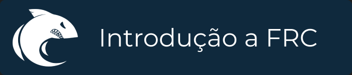

    

# Introdução à FRC
# O que é FRC
A First Robotics Competition (FRC) é uma das modalidades de competição [First ](https://www.firstinspires.org/about/vision-and-mission). É uma competição feita para alunos do ensino médio, com o intuito de potencializar seus habilidades e prepará-los para o mercado de trabalho. [Clique para mais](https://www.firstinspires.org/robotics/frc).
# Objetivo do Repositório
Este repositório tem como objetivo ser um guia inicial para qualquer equipe FRC, contando com alguns conceitos básicos de programação e um "overview" das principais e essenciais ferramentas usadas na competição.
# Documentação Detalhada
Para ter acesso a uma documentação detalhada dos principais conceitos FRC, acessa a nossa [wiki](https://github.com/FRC5800/Introduction-to-FRC/wiki) para mais informações. Uma observação importante é que a documentação é feita especialmente para a linguagem Java.
# Guias Auxiliares
Além dessa documentação, recomendamos fortemente que sejam consultados outros materias de auxílio, principalmnte os da própria competição. Abixo serão listados alguns links para documentações a parte:
- [FRC WPILib Documentation](https://docs.wpilib.org/en/stable/docs/zero-to-robot/introduction.html)
- [WPILib Example Codes](https://github.com/wpilibsuite/allwpilib/tree/main/wpilibjExamples/src)
