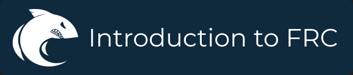

    

# Introduction to FRC
# What is FRC
The First Robotics Competition (FRC) is one of the [First](https://www.firstinspires.org/about/vision-and-mission) competitions. It is a competition made for high school students, with the aim of enhancing their skills and preparing them for the job market. [Click for more](https://www.firstinspires.org/robotics/frc).
# Purpose
This repository aims to be a starting guide for any FRC team, with some basic programming concepts and an "overview" of the main and essential tools used in the competition.
# Detailed Documentation
To access detailed documentation of the main FRC concepts, access our [wiki](https://github.com/FRC5800/Introduction-to-FRC/wiki) for more information. An important note is that the documentation is made especially for the Java language.
# Auxiliary Guides
In addition to this documentation, we strongly recommend that you consult other documentations, especially those from the competition itself. Below are some links to separate documentation:
- [FRC WPILib Documentation](https://docs.wpilib.org/en/stable/docs/zero-to-robot/introduction.html)
- [WPILib Example Codes](https://github.com/wpilibsuite/allwpilib/tree/main/wpilibjExamples/src)
